# Cambio del captador de aceite de un Volvo S60


```
AUTOR: Samuel M.H.
FECHA: 08-Agosto-2021
LICENCIA: todos los derechos reservados.
```

**Exención de responsabilidad.**

Este documento es un registro fruto de mi experiencia solucionando un problema.
No soy mecánico ni estoy cualificado para realizar reparaciones en vehículos. No obstante, todo lo he hecho bajo mi responsabilidad. He creído necesario documentar mi labor porque cuando afronté el problema no existían guías parecidas en castellano y la escasa información que encontré fue en foros.
Recuerda que si intentas reproducir mis pasos, lo haces bajo tu propia responsabilidad y que no te garantizo el resultado final. Si tienes dudas, te puedo aconsejar, pero lo mejor que puedes hacer es llevar el vehículo a tu taller de confianza y dejarte guiar por un profesional.


## Descripción del problema
Hay diferentes síntomas que pueden tener un origen común.

* El coche se para en punto muerto a ralentí. Bajan las revoluciones hasta que se para el motor. Normalmente la centralita intenta corregirlo pegando "acelerones". Se nota que al motor le pasa algo. Esto también puede suceder por unas bujías en mal estado (aunque las había cambiado hace poco y descarté la opción).
* Fugas de aceite no localizadas.
* El coche "silba". Este es **el efecto más notorio**, y es que el motor produce un ruido muy característico.
Ejemplos: 
  * [IPD Volvo - What is that mystery squeal on your Volvo?](https://www.youtube.com/watch?v=YGh5nxlFv54)
  * [2002 Volve S60 Whistling noise from motor](https://www.youtube.com/watch?v=m3XhH8Q-feM)


## Detección del fallo
Aunque suena como si patinara una correa, un rodamiento desgastado o algo rozara, la prueba de detección del fallo es que al aflojar la varilla del aceite o quitar el tapón del aceite, el ruido desaparece.

Sucede que el captador de aceite del motor, en inglés [PCV](https://www.ipdusa.com/blogs/512/Volvo-PCV-Issues-Explained) (Positive Crankcase Ventilation) está estropeado. Puede haber varias razones:

1. El silbido que hace el motor lo produce una membrana de la pieza que se rompe y actúa como silbato. Es aire pasando por una pieza de plástico quebrada que la hace vibrar.
2. Los acelerones y pérdida de rendimiento se deben a que esta pieza, por su naturaleza, es fungible, se desgasta. Hay que cambiarla cada 100.000 Km ya que se llena de residuos de aceite. Empeora si no somos escrupulosos con los mantenimientos de cambio de aceite. 


## Reparación
La reparación consistirá en sustituir la pieza gastada, el captador de aceite (PCV, oil trap en inglés).

Aunque suena a poca cosa, dicha pieza está escondida debajo de la toma de admisión del motor, con lo que hay que desmontar unas cuantas piezas. Es tedioso pero no complicado si tienes algo de experiencia y no eres un manazas.


## Herramientas
En general no hacen falta herramientas muy complejas. Todo lo tenía en el típico maletín de llaves y carracas.

* Destornilladores torx.
* Carraca, extensores y multiángulo (en las fotos se vé).
* Guantes.
* Foco o linterna.
* Llaves de vaso.
* Mucha paciencia
* También puede ser útil un amigo para sujetar piezas y dar ánimos.

## Materiales

* Papel de cocina.
* Piezas a reemplazar (captador de aceite).
* Abrazaderas de las buenas. Lo comento más adelante.

## Pasos

### Conseguir las piezas
Lo primero fue acercarme al concesionario (taller) de Volvo de mi ciudad, hablar en confianza con el dependiente y que me echara una mano con la referencia de las piezas una vez le dije el número de bastidor.

Esta es una foto que me dejó tomar con el despiece y los números de referencia.
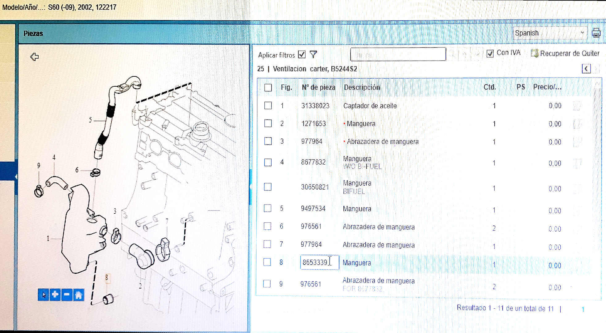

Yo compré las piezas 1 (captador de aceite) y la 8 (un tubo de conexión). Me salío por unos 80€.

Mi consejo es que os dejéis aconsejar y no compréis más de lo necesario, ya que las piezas son caras y no se degradan tanto como creemos. También hay que tener cuidado porque por internet dan unas referencias que pueden no corresponderse con las de vuestro modelo (problemas de comprar online). Aquí he de reconocerlo que tuve suerte con el dependiente.


### Desconectar la batería
Ya tenemos el coche en nuestro taller (o algo parecido). Lo primero es desconectar la batería para evitar sustos. Si este paso no lo tienes claro (la batería está en el maletero) o se te complica, no te recomiendo que sigas con la reparación. En serio.

Batería con tapa en el maletero.
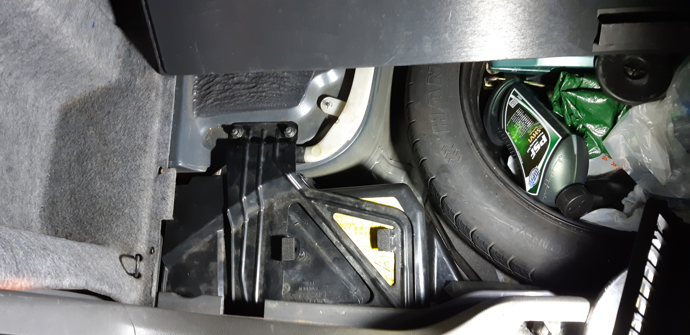

Batería desconectada.
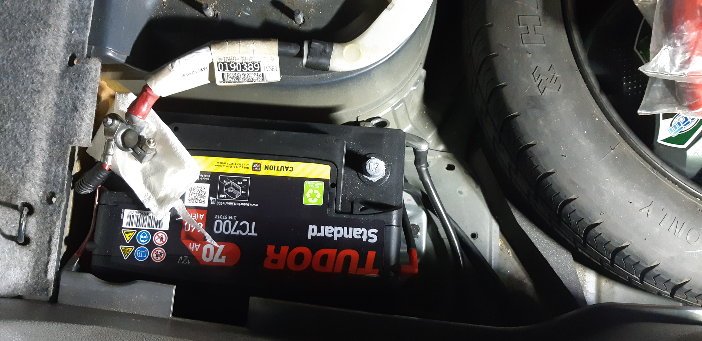
Sí, puse un papel de aislante porque no quería sacarla del maletero. Funciona.


### Desmontar la toma de aire
Ahora que estamos seguros de que no vamos a tener muchos chispazos. Abrimos el capó y desmontamos la toma de aire. Va a presión. La dejamos apartada donde no moleste por ahí.

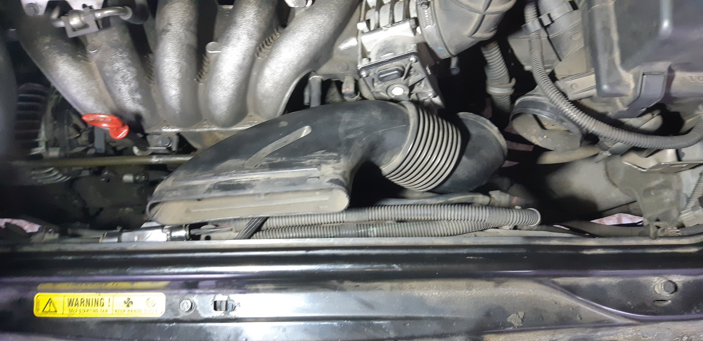


### Desmontar la varilla del aceite
Seguimos y desmontamos la varilla del aceite, con el tubo y todo.

1. Quita el tornillo con una llave de tubo de  10mm. 
2. Tira hacia afuera y sale todo.

Esta es la varilla del aceite. Si no lo sabías... malo, no sigas.

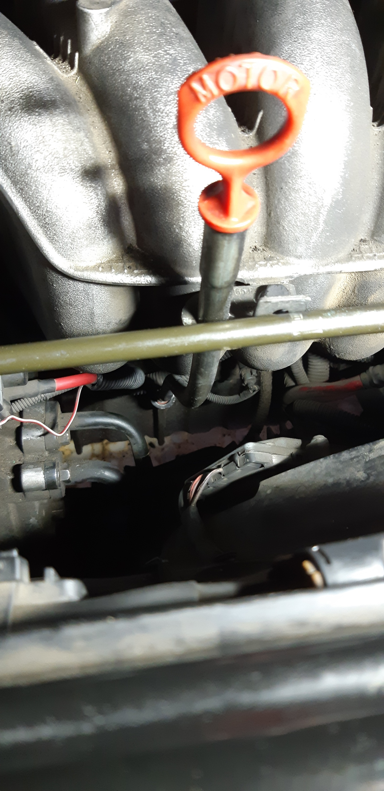

Una vez quitado el tornillo, sale todo. Cuidado con el sello rojo del extremo, no lo pierdas.

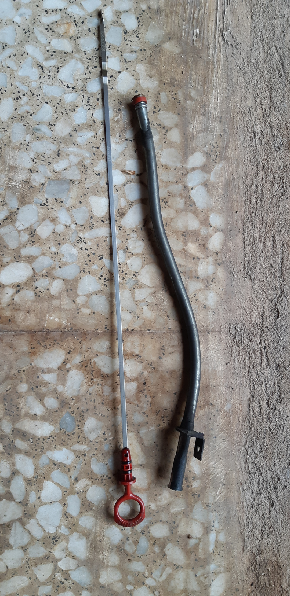

Detalle de dónde va encajada en la parte inferior del motor.

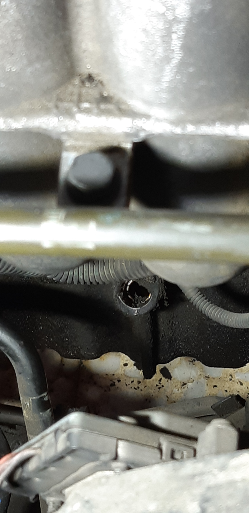


### Desconectar la toma de combustible
Desconectamos la toma de combustible. Esto es de lo más difícil... si no sabes de qué va. Tranquilo que para eso me he pegado yo antes y te lo explico.


La toma de combustible lleva (en mi caso gasolina) el combustible de la bomba de combustible a los inyectores. Es simplemente un conector.

Aquí se vé el sistema. El rail de inyectores (barra horizontal) y la toma de combustible el artefacto que está un poco más abajo con un tubito de metal a cada lado.

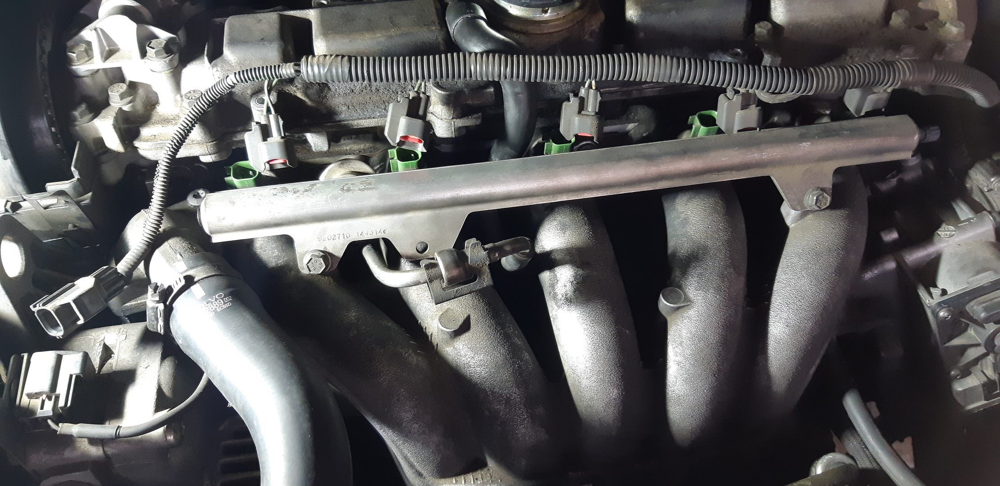

El sistema de combustible va bajo presión, así que si lo desconectamos sin más, nos salpicará combustible. Tenemos que quitar la presión del circuito. Si te fijas en la foto anterior, en el lateral derecho del rail,  hay un tapón como de cámara de bicicleta. Lo desenroscas y debajo hay ¡una vávula como de bicicleta! Ponte unas gafas de seguridad por si salpica, coges papel de cocina, lo envuelves y presionas la válvula con cuidado con un destornillador. Si hay presión, saldrá gasolina, poca. Podemos continuar con seguridad.

Esta es la toma de combustible, lo que queremos desmontar. Quitar la abrazadera es muy fácil, pero hay más y tiene truco.
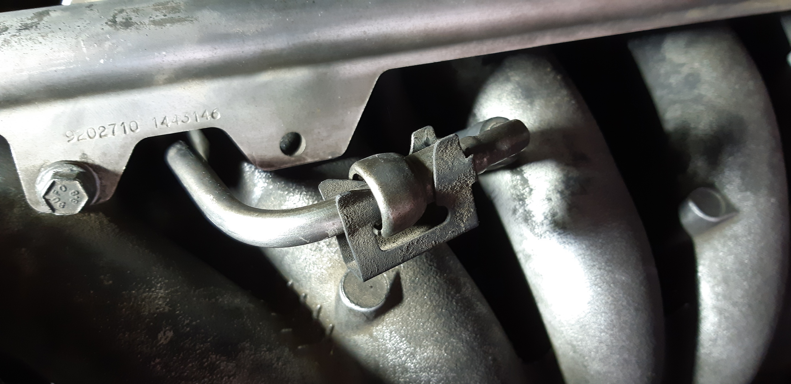

Esta es la toma de combustible desmontada. Fíjate bien en las pestañas que tiene la parte hembra (derecha) y que sujetan la parte macho (izquierda) cuando está encajada.

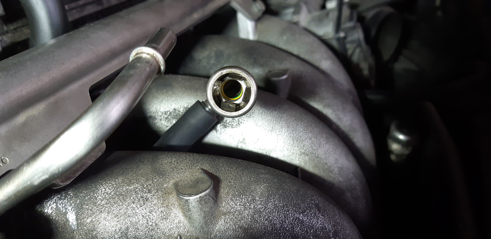

La forma de desencajar los dos tubos es presionando con una pieza especial que yo no tenía ni sabía dónde comprar. En 15 min y al segundo intento, me fabriqué una pieza que podría servir con un tubo de macarrón. He visto que hay gente que lo hace incluso con capuchones de rotuladores.

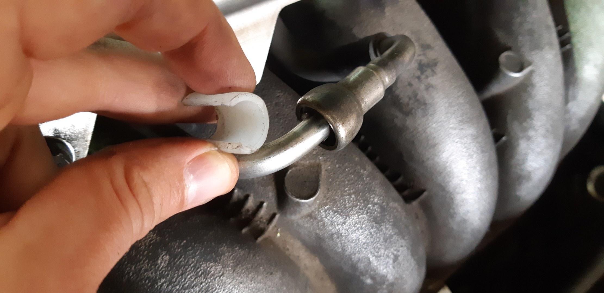

La forma de usarla es rodear la parte macho y empujar hacia la hembra para presionar las pestañas y liberar el mecanismo. Hay que presionar con relativa fuerza, pero no intentar separar a lo bruto los tubos, tienen que salir solos. Para unirlos es más sencillo, se mete el macho, suena click y listo.

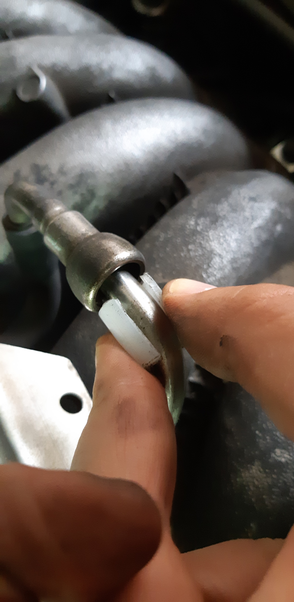

Si todo ha ido bien, tenemos la línea de combustible desmontada.

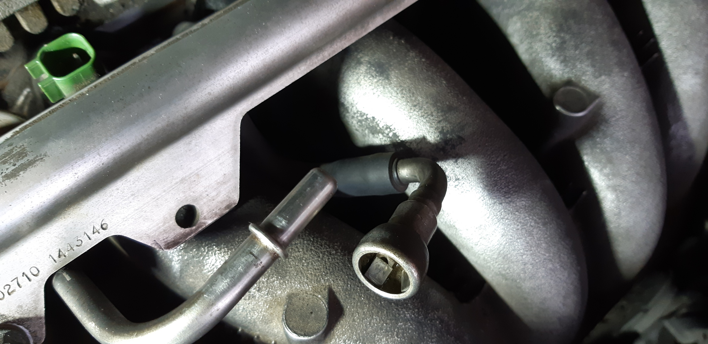


### Desmontar el rail de inyectores

1. Desmonta el sistema eléctrico. En mi caso, cinco inyectores (uno por cilindro). Con lo que encima de cada inyector hay un conector eléctrico que lo controla. En la foto ya se ven desmontados
2. También hay dos tornillos de 10mm que sujetan el rail. Quítalos también.


En la foto se ve la línea de combustible desconectada, los conectores eléctricos desconectados y en un extremo la válvula de purgado de combustible.

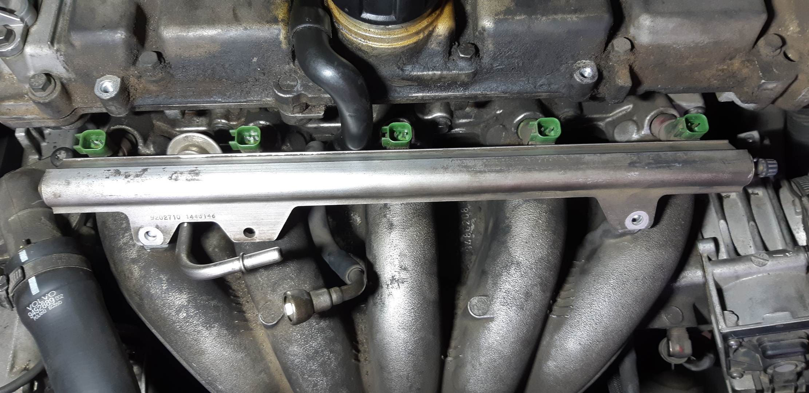

Saca el rail con cuidado tirando hacia tí. Los inyectores son tubos que van encajados a presión. No torsiones ni apalanques.

Detalle de dos inyectores conectados al rail.

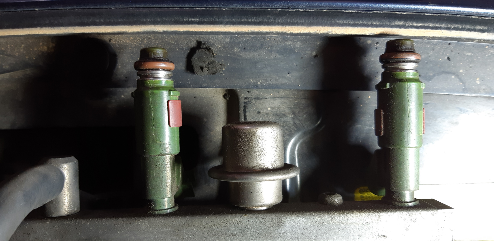

Hueco donde van encajados los inyectores.

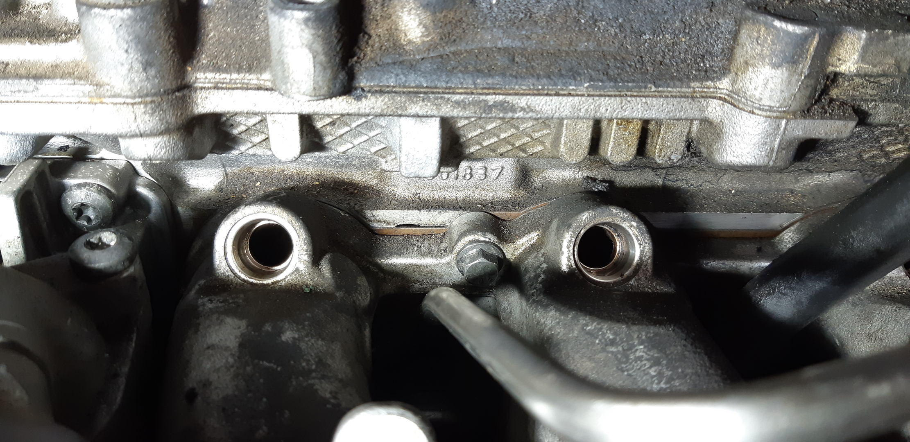

Y ya está, deberías tener el rail con los inyectores en la mano mientras gritas que eres el p**to amo. Si has llegado hasta aquí, vas por muy buen camino.


### Desmontar la tapa del motor
Toca desmontar la tapa del motor. Quita los 8 tornillos T30 y saca las 3 piezas de plástico que cubren el motor (bobinas, bujías y alguna cosa más). La pieza de la izquierda cubre la correa de transmisión, va sujeta con dos pestañas (una por delante y otra por detrás).

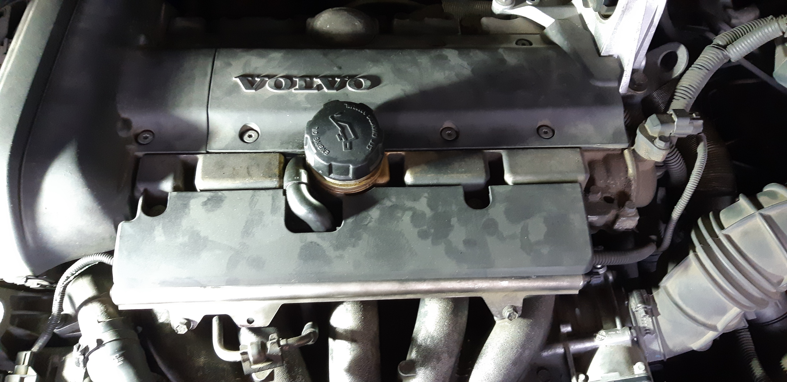


### Desconectar la manguera del aceite
Debajo de la tapa del motor está la manguera (despiece 5). Seguramente lleve una abrazadera [Oetiker](https://www.oetiker.com/es). Con un destornillador y cuidado de no dañar la manguera, desmóntala y tírala a la basura porque son de un solo uso (la abrazadera).

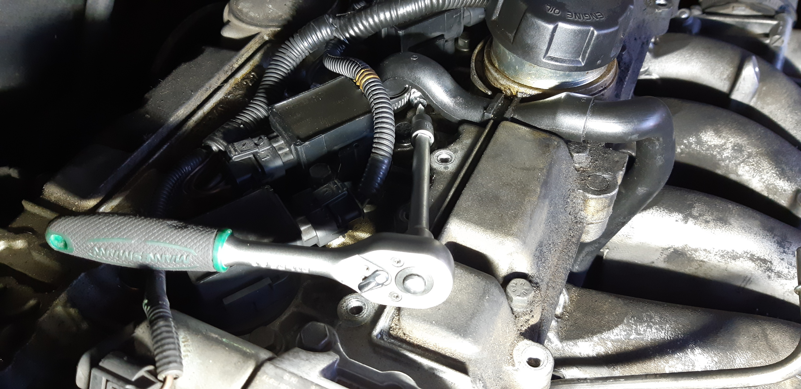

La foto es de cuando monté todo. Por eso la abrazadera es diferente, de las de tornillo.


### Desmontar la toma de admisión
El siguiente paso es desmontar la toma de admisión del motor. Prepárate.

Quita los 4 tornillos superiores (10mm) que la sujetan, están entre los huecos de los inyectores por encima.
En la foto puedes ver un detalle de la llave de carraca con 2 extensores y la pieza multiángulo. Sin una herramienta así, no creo que sea posible continuar, ya que el acceso a los tornillos es complejo por los ángulos y distancias.

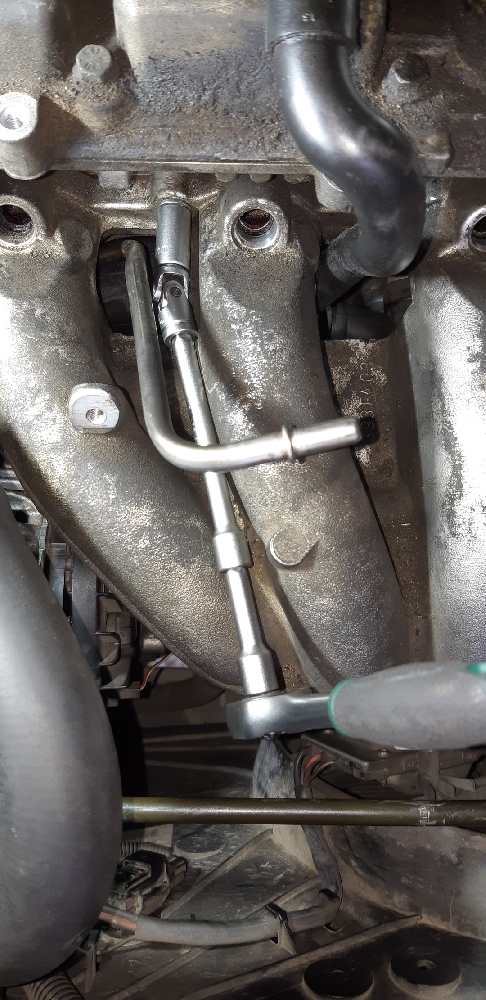

Afloja los 3 tornillos inferiores (10mm). No hay que quitarlos, solo aflojarlos ya que la pieza va encajada sobre estos.

Detalle de tornillo superior quitado e inferior aflojado.

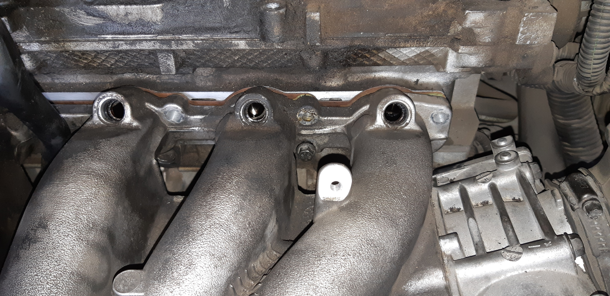

#### El tornillo lateral
De los tornillos inferiores, habrás encontrado los dos que se ven bien (entre los inyectores). El tercero está escondido a la izquierda. Casi debajo de la válvula del sistema de refrigeración. Aflójalo también.

Si sigues el extensor de la carraca, llegas al tercer tornillo.

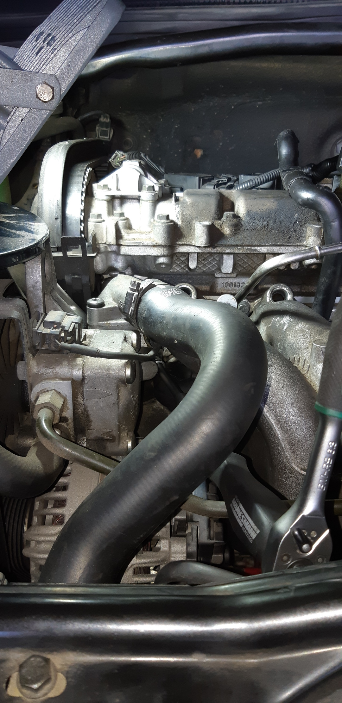

Vista superior del tornillo desde la válvula de refrigeración.

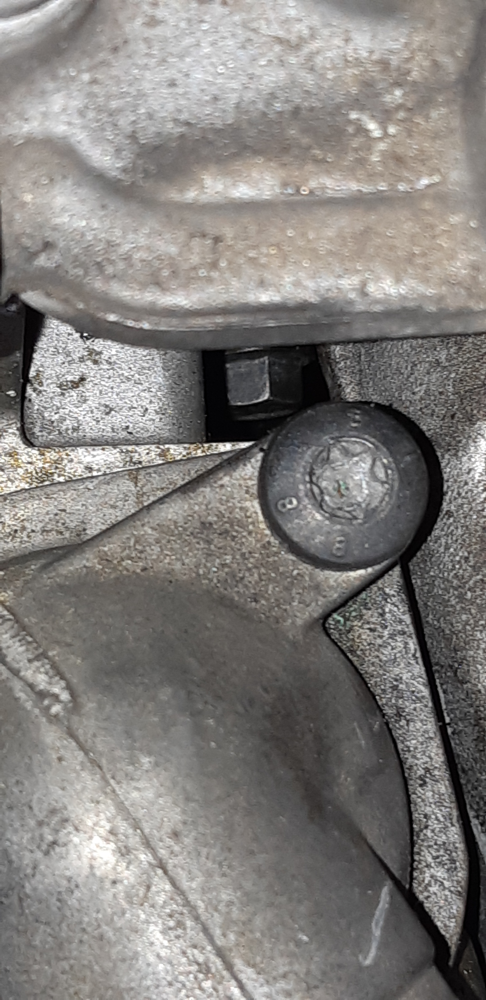

Vista frontal del tornillo desde el alternador. Fíjate que debajo del tornillo hay una manguera que va del captador de aceite a la toma de admisión (despiece 4). Si puedes, quítala, sale a presión (yo no pude porque estaba pegada). Si no, ya saldrá al sacar el bloque de la toma de admisión.

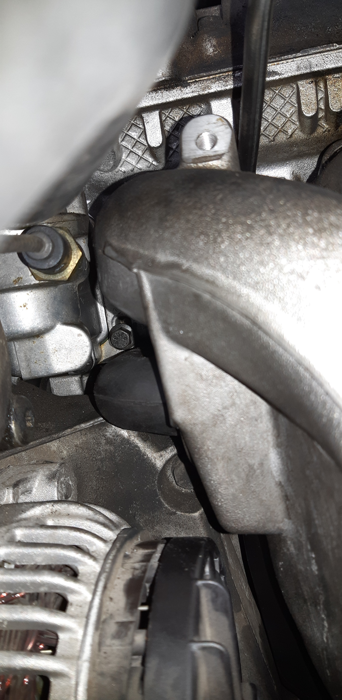

#### Conexión eléctrica
Debajo del enganche del capó, hay un conector eléctrico que hay que desatornillar (10mm) y desenchufar para que no moleste al sacar la toma de admisión.

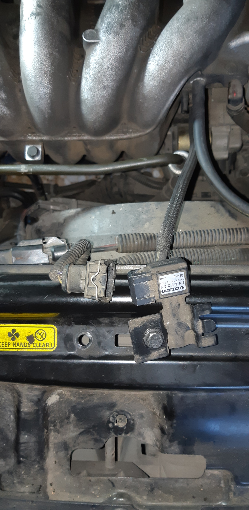

#### Tornillo inferior
En mi caso, la toma de admisión aún tenía un tornillo más que no ví en ningún vídeo ni manual. En la parte inferior lleva un tornillo de 12 mm que la rosca fuertemente al chasis. Quítalo. Está bien escondido y dudo que se pueda ver si un espejo y una linterna, así que toca meter el brazo bien adentro para llegar y usar la llave de carraca grande.

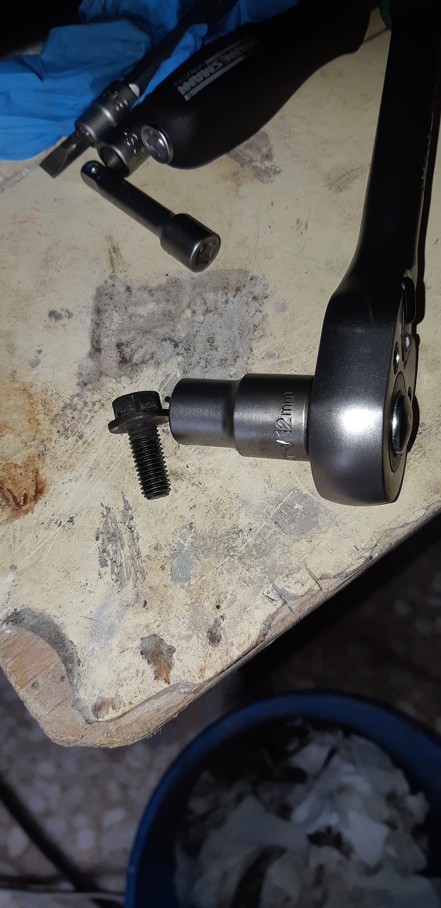

Una vez desmontado, ya sale la pieza entera. Ten cuidado con la toma de combustible que es rígida y con la manguera que va donde las bujías (despiece 5). Aparta la toma de aire al lado derecho doblando un poco la mangera gorda que proviene del filtro del aire. No hay que desmontar más.

Toma de admisión desmontada. Detalles que se ven:
* Inferior, rosca del el tornillo inferior al chasis.
* Lateral, conexión para la manguera (despiece 4).

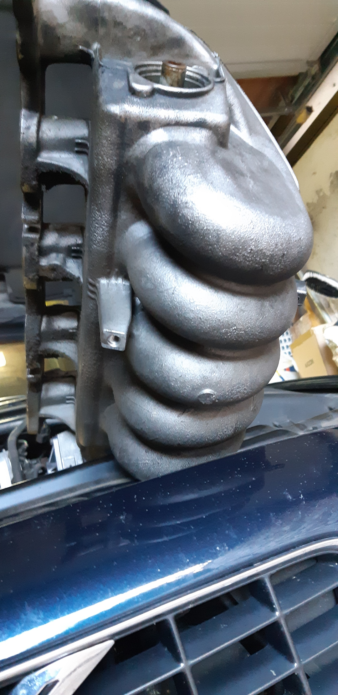

Si te asomas al hueco que has dejado en el motor, verás algo así.

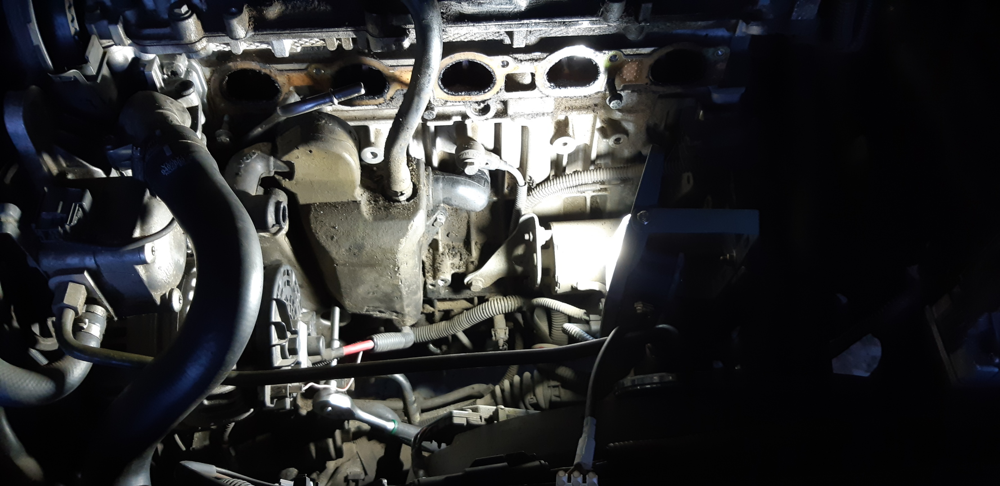

Fíjate en:

* Los 4 tornillos superiores están desmontados.
* Los 3 tornillos inferiores están aflojados y siguen puestos.
* La mugre que se forma en la entrada al motor.

Es buen momento para tomarse un descanso.


### Cambiar el captador de aceite

Esta es la pieza que tenemos que cambiar, va unida con con 2 tornillos de 10mm.

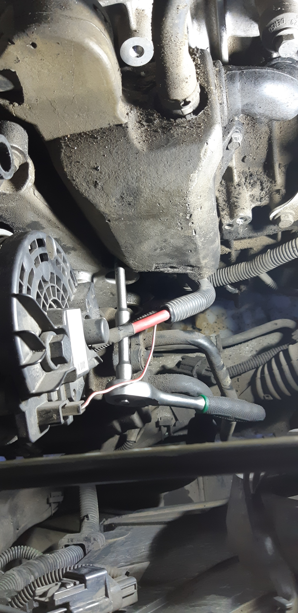

Sale tirando con cuidado.

El conector inferior lleva 2 tornillos T20. Lo sustituiremos por la manguera (despiece 8).

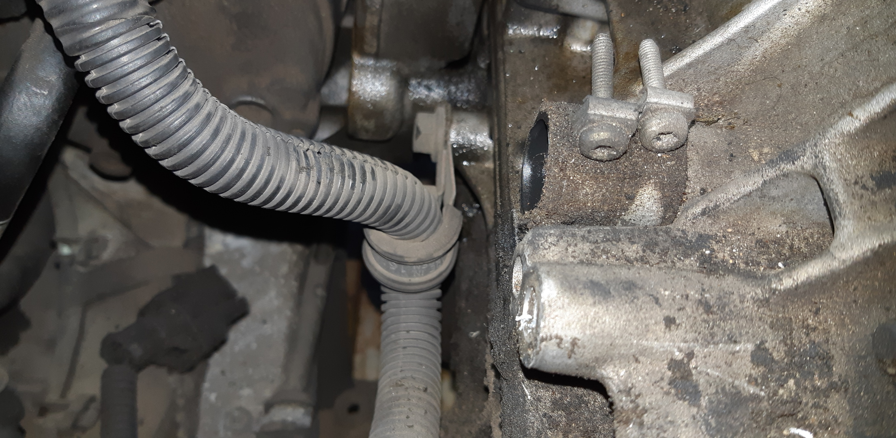


Esta es la pieza nueva que tenemos que montar.

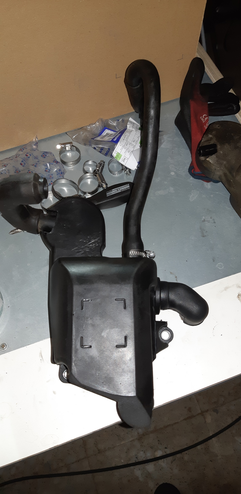

Comparativa de pieza nueva y pieza vieja.
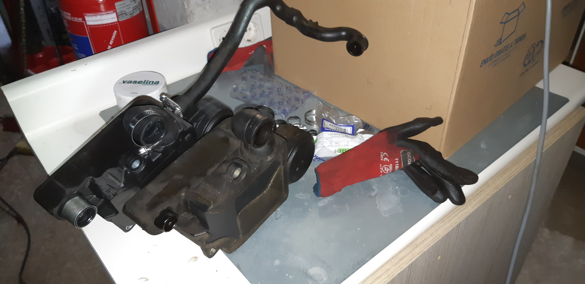


### Volver a montarlo todo
Ahora sólo queda montarlo todo en orden inverso con los nuevo componentes. Ya que estamos con un buen desmonte, dejo unas cuantas ideas de mantenimiento.

#### Limpieza y mantenimiento
Es buena idea para limpiar y revisar piezas.

La toma de admisión.

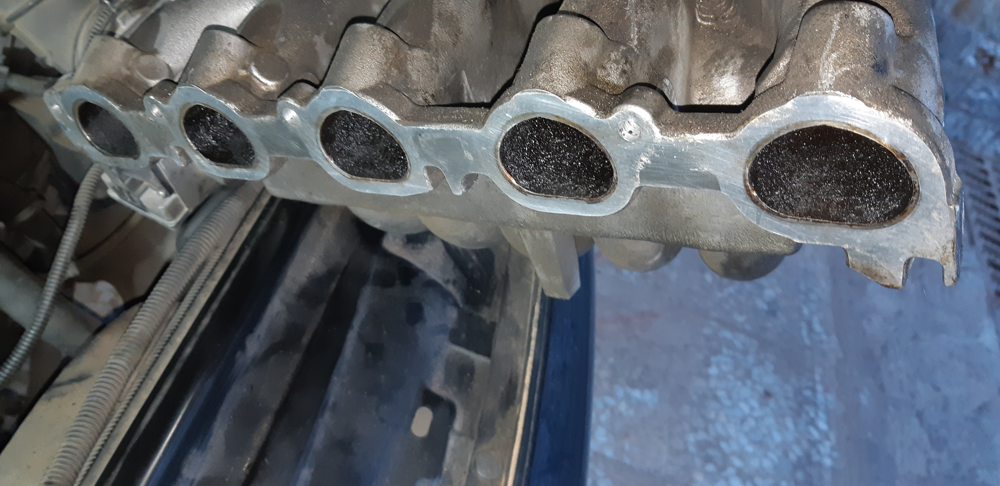

La parte del motor y verificar el sello y sustituirlo si fuera necesario.

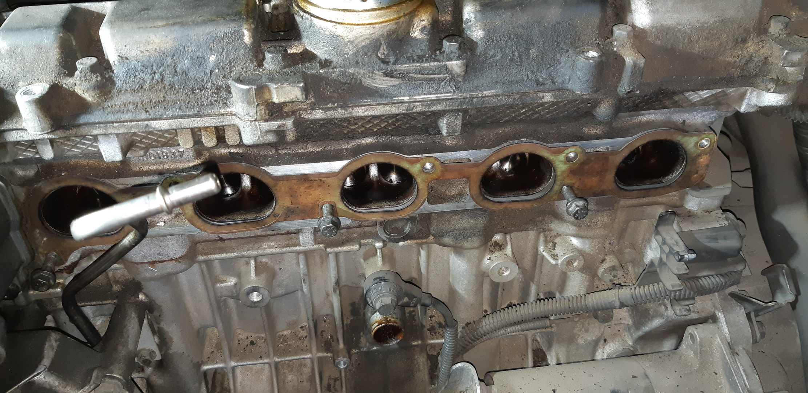


#### Vaselina
Hay piezas que van a presión, como la manguera 8 o los inyectores. Para que encajen con facilidad, se puede aplicar un poco de vaselina. También es buen momento para revisar los inyectores, que estén limpios y las juntas tóricas no estén partidas o agrietadas.


## Sobre las abrazaderas oetinker

Las abrazaderas Oetinker molan, dan buen resultado, se manipulan con facilidad y serán lo mejor para unir mangueras... si tienes las herramientas. Si no, pues son un fastidio. Para este tipo de trabajos no compensa comprarse todo el utillaje. Hablé con mecánicos de diferente índole (barrio, competición, concesionario) y la respuesta fue unánime: -"Usa abrazaderas normales, de las de tornillo, eso sí, no del chino".


## Recursos
Dejo unos cuántos vídeos que me inspiraron para hacer este arreglo, aunque ya me hubiera gustado tener esta guía.

* [POORLY DESIGNED Volvo S60 PCV System *COMPLETELY Clogged With CARBON*](https://www.youtube.com/watch?v=OlnE2WASLYc)
* [Volvo S60 PCV Breather System Replacement - Prevent Smog! (C70, S60, S80, V70, XC70, XC90)](https://www.youtube.com/watch?v=oEOzIoVxO4s)
* [Volvo S60 V70 PCV replacement Non Turbo Tips + Tools 2001-2009 /// See comments section](https://www.youtube.com/watch?v=3fEjbMpVSfo)


