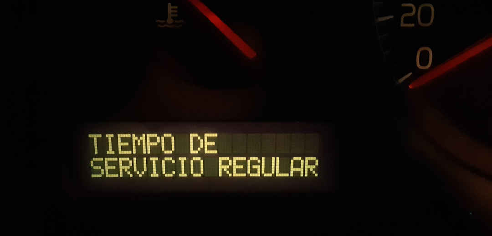

# Borrar el mensaje de "tiempo de servicio regular" en un Volvo S60

```
AUTOR: Samuel M.H.
FECHA: 23-Agosto-2021
LICENCIA: todos los derechos reservados.
```

## Descripción del problema
Más o menos, cada año, en la pantalla de mensajes del coche Volvo S60 aparece un mensaje que dice: `TIEMPO DE SERVICIO REGULAR`

Tal que así:


No es un problema como tal, porque solo te indica que le hagas un mantenimiento, pero es un incordio. Porque la misma pantalla se usa para avisarnos de cosas importantes, como: nos hemos dejado una puerta abierta o el maletero, se ha fundido una luz, no hay refiregerante, etc.

No es bueno que secuestren nuestra atención con mensajes irrelevantes.


## Solución
Estos son los pasos para borrar el mensaje (hasta el año que viene).

1. Poner la llave de arranque en la posición 1. 
2. Apretar botón de reiniciar cuentakilómetros, que se pondrá a cero, y no soltar el botón.
3. Llave a posición 2.
4. Esperar. Cuando el cuentakilómetros vuelva de cero al valor original (¿o suene un bip?) soltar el botón.
5. Llave a posición 1.
5. Llave posición 0, coche apagado.
6. Al poner otra vez el coche en marcha, el mensaje estará eliminado.


## Nota aclaratoria: posiciones de la llave de arranque
La llave de arranque tiene 4 posiciones:
* 0: coche apagado. Se puede meter y sacar la llave
* 1: coche con conexión eléctrica. Posición para apagar el motor.
* 2: se encienden los chivatos y es la posición normal de conducción.
* 3: posición para arrancar el coche. Hay que mantenerla manualmente.

