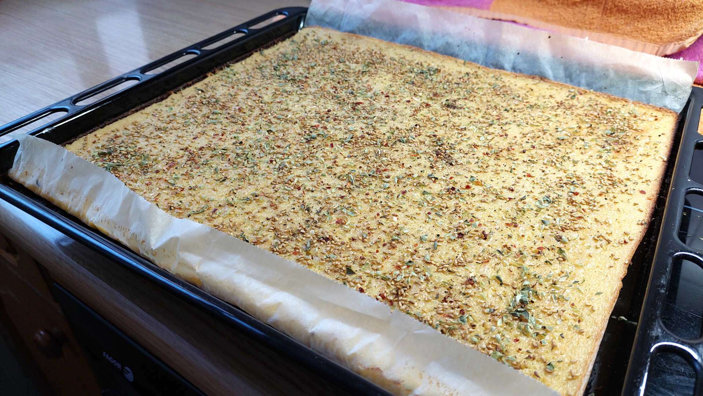
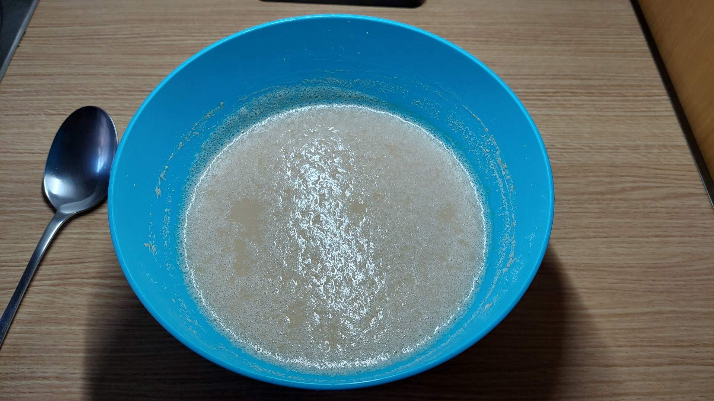
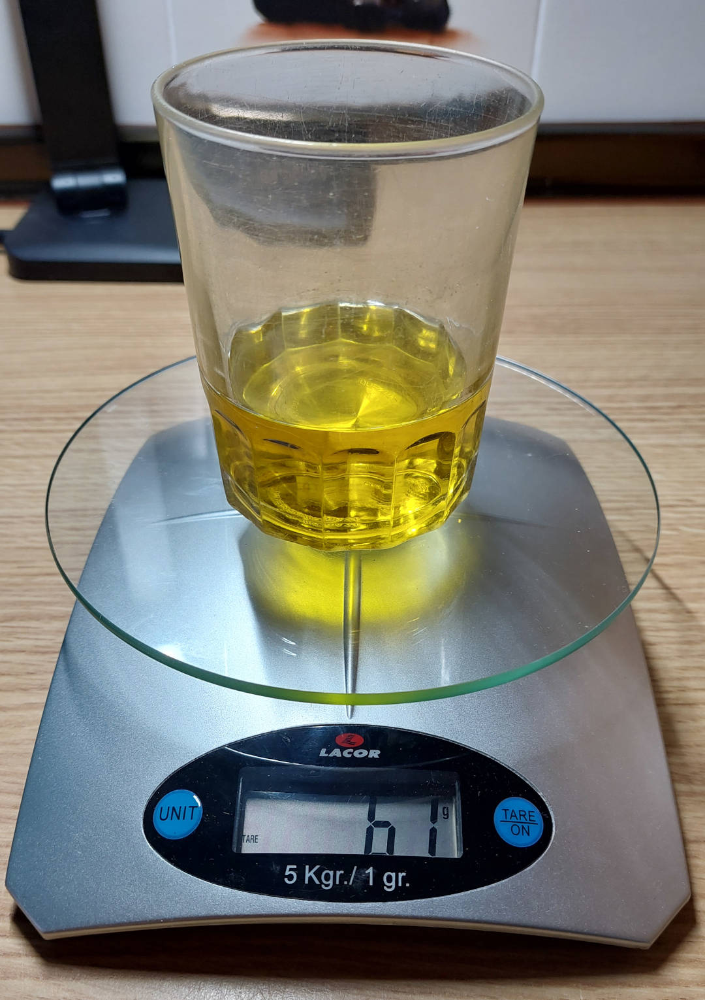
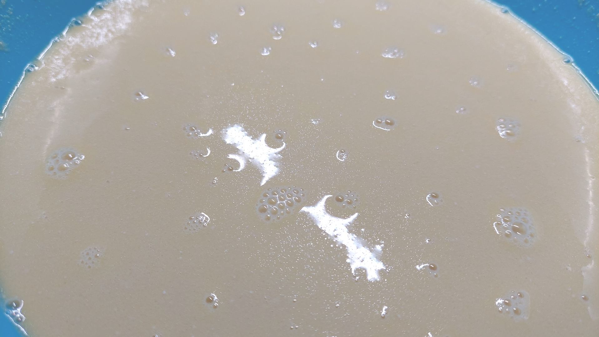
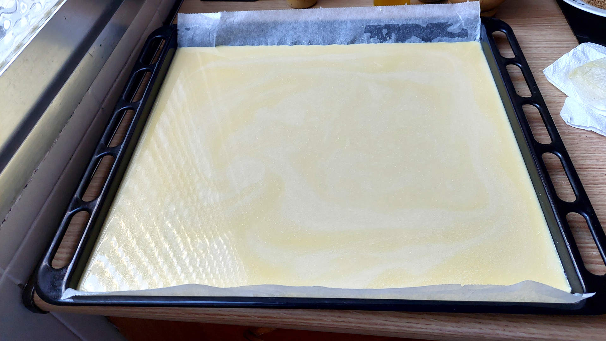
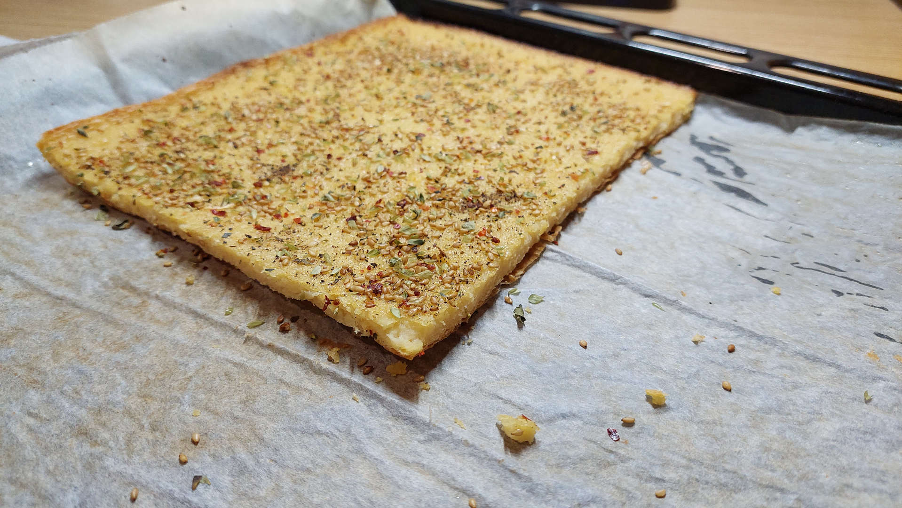

# Farinata di ceci

```
AUTHOR: Samuel M.H.
DATE: 20-Julio-2024
LICENCE: all rights reserved.
```



## Ingredientes
* Harina de garbanzos 300gr
* Aceite de oliva 50gr (ver imagen Paso 4)
* Agua 900gr (4 vasos)
* Sal hasta 10gr (1 cucharadita pequeña de las de café)
* Condimentos: ajo, cebolla, hierbas
* Pimienta


## Procedimiento
1. Mezclar el agua y la harina hasta conseguir una masa homogénea.
2. Dejar reposar al menos 6 horas. Si se superan las 10 horas, dejarlo en el frigorífico.
3. Retirar la espuma que se haya formado.
4. Remezclar con el aceite y la sal.
5. Preparar bandeja con papel vegetal. Rellenarla hasta que tenga un grosor máximo de 5mm. Es una torta fina.
6. Añadir los condimentos.
7. Calentar el horno a 250ºC.
8. Hornear 10 min en la base. En mi caso, posición 2 de 4.
9. Hornear 10-15 min en la parte media-superior para que se dore. En mi caso, posición 4 de 4, arriba del todo.
10. Darle un toque de pimienta y condimentos.

## Notas
* Es una torta salada de garbanzos.
* Se sirve caliente/templada.
* La receta da para hacer 1 bandeja.
* Hice la receta con 61rg de aceite. En mi opinión con la mitad hubiera servido.
* Puede estar bien añadir condimentos antes de hornear para darle sabor a la mezcla.
* La condimenté recién horneada con sésamo recién tostado, pimienta molida, orégano y un preparado de hierbas para pasta (el del Mercadona).
* Dura 3 días en la nevera.

## Imágenes
Paso 3. Dejé la mezcla en el frigo casi 1 día. Se forma espuma que debemos retirar.


Paso 4. Aceite a ojo (por si no tienes báscula) hay 10 gr más de aceite. 


Paso 4. Mezclada con el aceite y la sal a conciencia.


Paso 5. La bandeja está preparada con papel de hornear y engrasada. La cantidad de mezcla da para 1 bandeja. Se vé que la mezcla no es homogénea, esto se debe a una espera larga entre la mezcla y el vertido. Hay que remezclar antes de verter en la bandeja.


Paso 9. Recién horneada


Recién comida.



