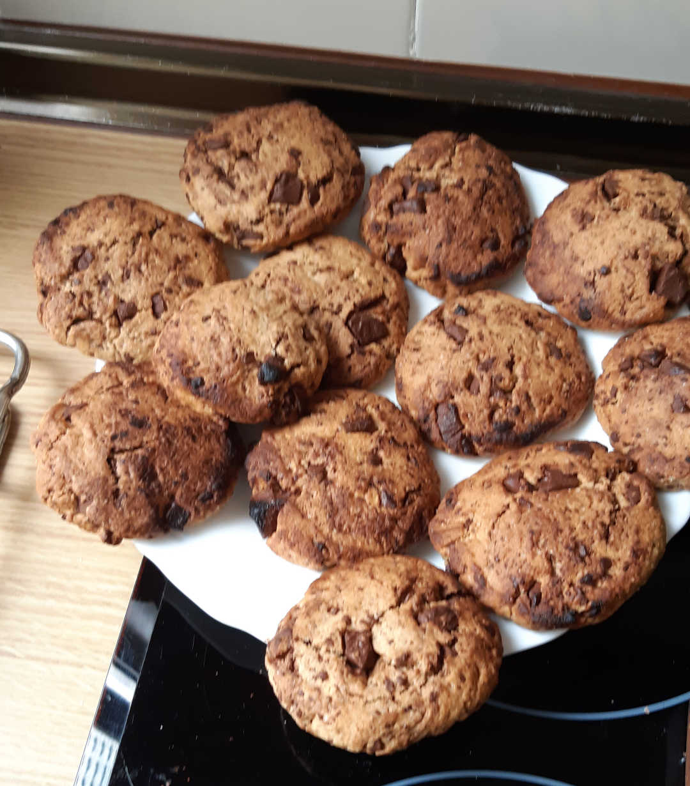
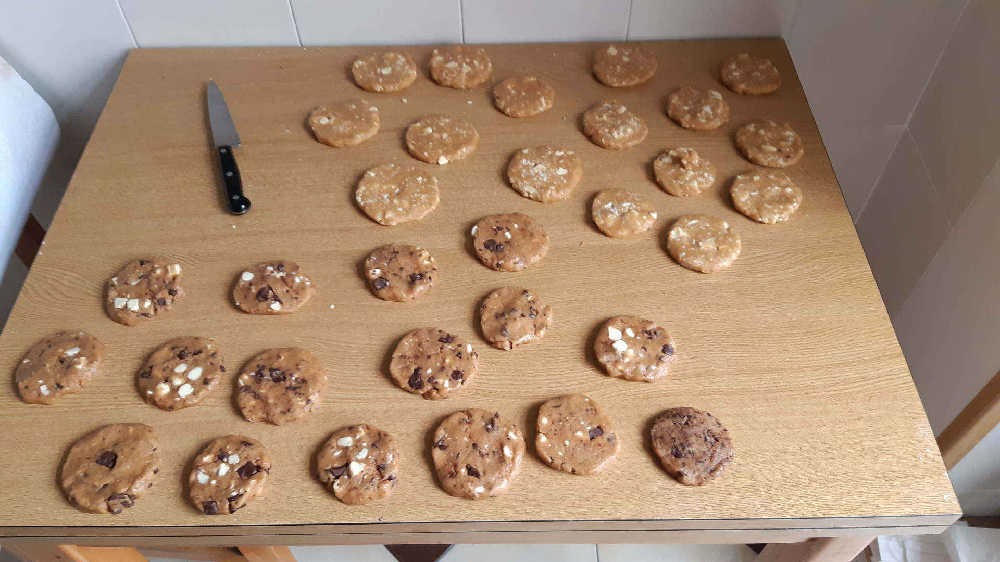
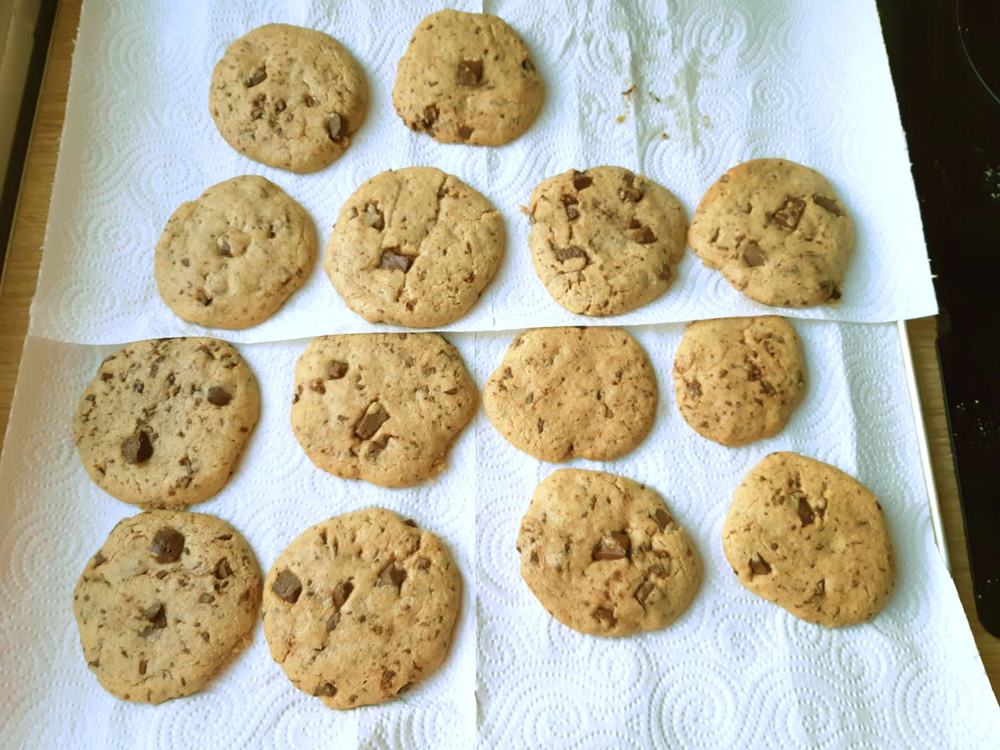

# Galletas estilo americano

```
AUTOR: Samuel M.H.
FECHA: 01-Mayo-2020
LICENCIA: todos los derechos reservados.
```




## Ingredientes
* Harina (3uds) 450gr
* Azucar blanco (1ud) 150gr
* Azucar moreno (1ud) 150gr
* Mantequilla (1ud) 150gr
* Ralladura de chocolate (2 uds) 300gr
* Gasificante 1 (cucharadita de té)
* Bicarboanto 1/2 (cucharadita de té)
* Sal 1/2 (cucharadita de té)
* Vainilla (1 vaina o 2 cucharaditas)
* Huevos 2


## Procedimiento
1. Mezclar la harina, el bicarbonato, el gasificante, la sal y el azucar en un bol.
1. Añadir la mantequilla, a temperatura ambiente.
1. Batir bien los huevos en otro recipiente y añadir el polvillo del interior de la vainilla.
1. Rallar el chocolate para hacerlo trocitos.
1. Mezclar todo, menos el chocolate, con las manos hasta que quede una pasta tirando a dura y grasa.
1. Añadir el chocolate a la masa.
1. Hacer toda la masa un rulo y cortarlo en rodajas de 1 dedo de ancho más o menos para hacer la forma de las galletas.
1. Poner las galletas en una bandeja de horno sobre papel de cocina, 10-12 galletas por bandeja aprox.
1. Hornear a 190ºC en la parte superior del horno durante 8-10 minutos.
1. Aunque parezca que estan crudas, no superar el tiempo de horneado. ¡No las tuestes en el horno!
1. Sacar del horno, dejarlas reposar 2 min en la bandeja y ponerlas a parte en una rejilla para que se enfríen.


## Notas
* Las galletas suben, no hay que hacer las formas muy gordas.
* Son muy dulces, se puede reducir la cantidad de azucar. Con la mitad de azucar salen bien.
* El chocolate Valor a la taza da buen resultado. 1 tableta es la medida justa para que sepan bien a chocolate.
* No merece la pena hacerlas con chocolate blanco. No sabe a nada.
* El gasificante es levadura química, Royal o similar.
* La sal es opcional. Le dan un puntillo, no pasarse.

## Imágenes
Galletas preparadas antes de hornear.


Galletas recién horneadas.


Galletas recién horneadas. Demasiado tostadas.

