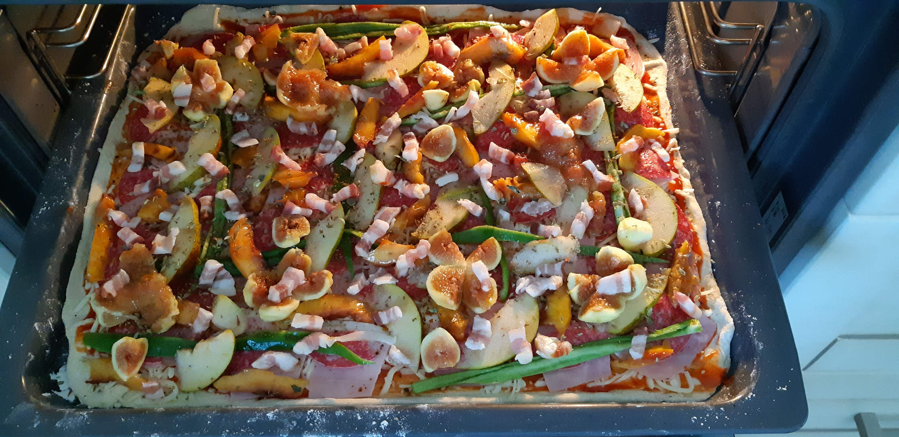
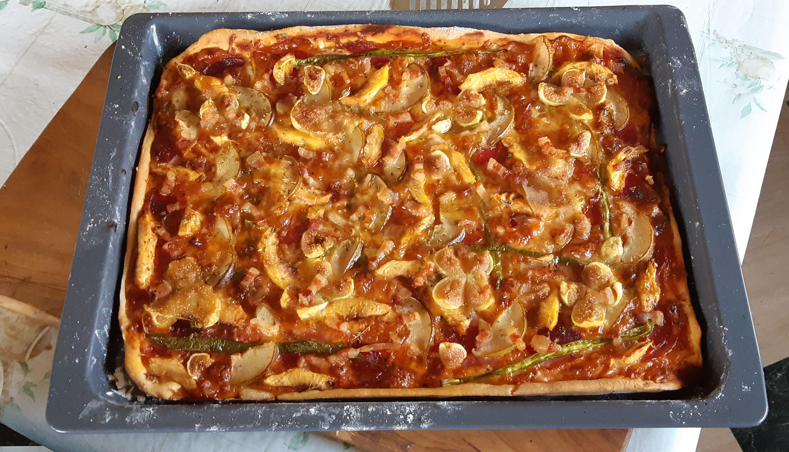

# Masa de pizza
```
AUTOR: Samuel M.H.
FECHA: 29-Diciembre-2020
LICENCIA: todos los derechos reservados.
```


## Ingredientes
* Harina de fuerza 830gr
* Levadura fresca (1 taquito) 25gr
* Agua 2.5 vasos cortos
* Sal 1.5 cucharaditas de té
* Aceite de oliva 3 chorrazos


## Procedimiento
1. Hacer un volcan de harina en la mesa. Salvar un poco para el amasado final 30gr aprox.
1. Añadir 1 vaso de agua en el hueco del volcán, la sal y mezclar hasta tener una pasta pegajosa.
1. Añadir la levadura desmigada, el agua restante y amasar muy bien. Se obtendrá una masa manejable pero que si se deja quieta, se pega.
1. Espolvorear harina sobre la mesa y dejar la masa plana, 1.5 cm de grosor aprox. Hacerle mini-cráteres con los dedos sin traspasarla para maximizar su superficie.
1. Echarle los 3 chorrazos de aceite de oliva. Plegar la masa, esparcir sobre los dobleces y amasar a conciencia. Parece que la masa se rompe, pero volverá a ligar. El punto de parada es una masa aceitosa con una consistencia parecida a la de un bonito trasero en su mejor momento, al apretar recupera la forma suavemente.
1. Espolvorear harina sobre la bola resultante para que no se pegue, hacer un rulo y partirlo en 5 bolas de 280 gr.
1. Cada una de las bolas da para una pizza de masa fina del tamaño de una bandeja de horno. Se puede aumentar la bola a 340gr para tener una pizza gruesa.
1. Las bolas se deben congelar inmediatamente (sin dejar fermentar) para usarlas otro día.


## Pizza
1. Coger una bola de masa. Dejar descongelar.
1. Dejar fermentar en un bol enharinado para que nose pegue y tapado con un trapo en un sitio templado y oscuro. Unas 2 horas dependiendo de la temperatura.
1. Tomar la masa que estará esponjosa y blandita. ¡No reamasar! Enharinar la mesa y darle forma con un rodillo para que ocupe lo que la bandeja del horno. Esta receta hace que incluso la masa más fina aguante todo lo que se le eche.
1. Enharinar la bandeja del horno suavemente, doblar la masa, moverla a la bandeja y desdoblarla con cuidado.
1. Poner salsa de tomate, queso mozzarela, fiambres y cosas al gusto y condimentar.
1. Hornear a 180ºC durante 25-35 min, al gusto. También depende del grosor, algunas han llegado a estar hasta 1 hora a 170ºC.
1. ¡Comer!


## Notas
* La levadura se echa después para que no se mezcle directamente con la sal, podría morir.
* Es fundamental un buen amasado y fermentación.
* Me gusta saturar la masa de aceite de oliva. Va al gusto.
* El aceite hace que la masa:
  * Tarde más en quemarse, con lo que podemos ser más laxos en el tiempo de cocción.
  * Sea más resistente, con lo que podemos hacer pizzas finas y crujientes.
  * Tenga más palatabilidad, está más rica.
* Se pueden añadir condimentos a la masa.
  * Azucar: 4 cucharadas. Hace que esté rica incluso quemada. Trampa de las gordas.
  * Cacao, pimentón, cúrcuma, canela, etc. Casos especiales de cocina experimental.
  
## Imágenes

Pizza antes de ser horneada.


Pizza después de ser horneada. Lista para comer.

