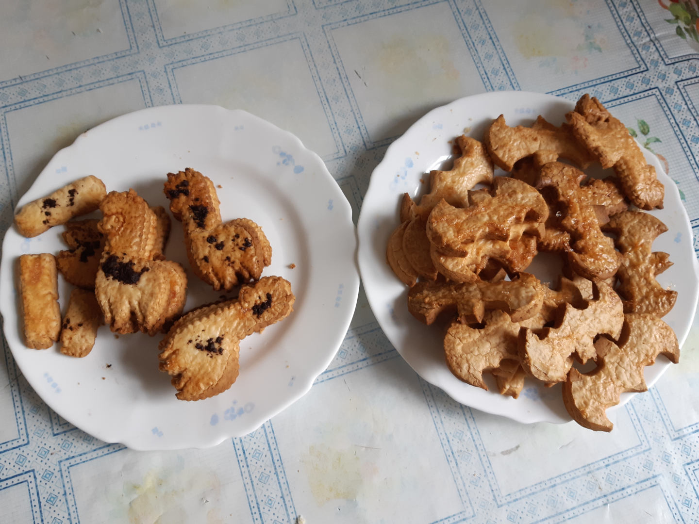

# Pastas de té

```
AUTOR: Samuel M.H.
FECHA: 26-Abril-2020
LICENCIA: todos los derechos reservados.
```



## Ingredientes
* Harina 360gr
* Mantequilla 250gr
* Azucar blanco 70gr
* Huevos 1


## Procedimiento
1. Separar el huevo en clara y yema.
1. Calentar la mantequilla para que sea manejable.
1. Mezclar la harina, la mantequilla, el azucar y la yema del huevo para hacer una masa.
1. Dejar reposar la masa 1 hora.
1. Extender la masa para hacerla de 1 cm de grosor.
1. Cortar la masa con algún cortapastas para darle la forma deseada.
1. Poner las pastas sobre una bandeja de horno con papel de hornear.
1. Pintar las pastas con la clara batida para que brillen.
1. Hornear durante a 175ºC durante 15 min en la bandeja de arriba.
1. Dejar reposar. A medida que se enfríen, se endurecerán y no serán tan fraǵiles.


## Notas
* La masa es bastante delicada, manejar las formas con un cuchillo ancho o una espátula.
* Es posible usar los recortes para volver a hacer una masa y recortar. Más de 3 veces la masa se vuelve muy quebradiza.
* Las pastas no son especialmente dulces, combinan bien con un té, se pueden mojar en leche... Es un dulce basante soso, sin cobertura.
* Es posible reducir la cantidad de mantequilla o aumentar el azucar para hacerlas más apetecibles.
* Se pueden glasear, darles una cobertura de chocolate o un toque de mermelada para alegrarlas.

