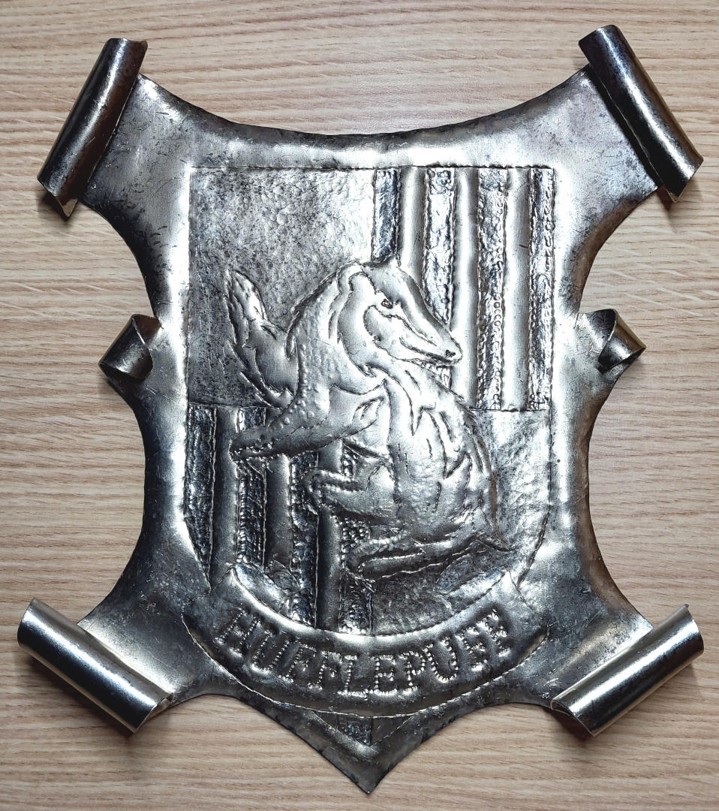
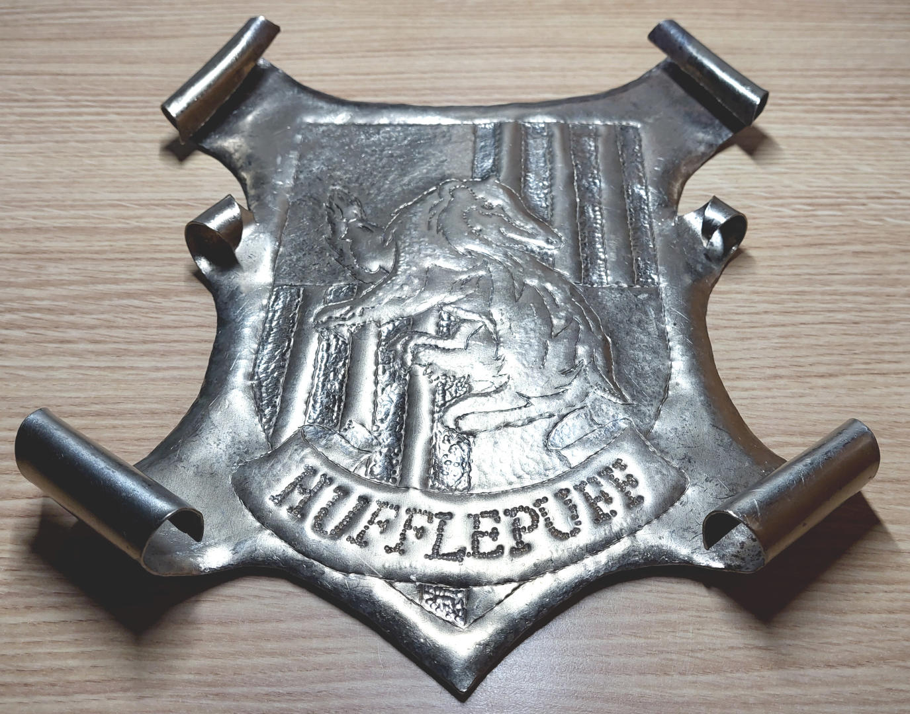
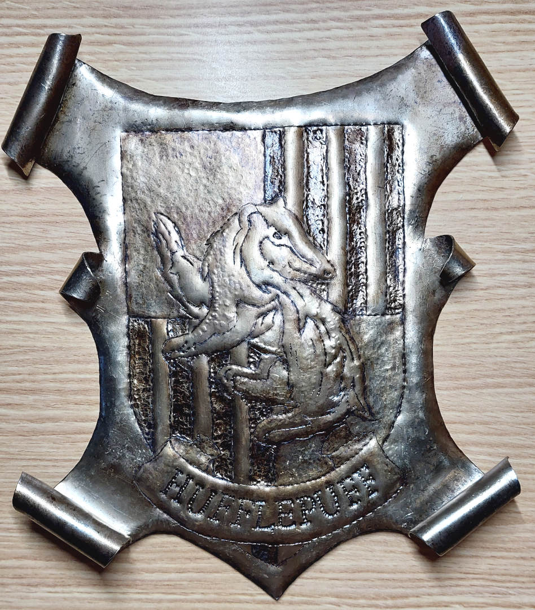
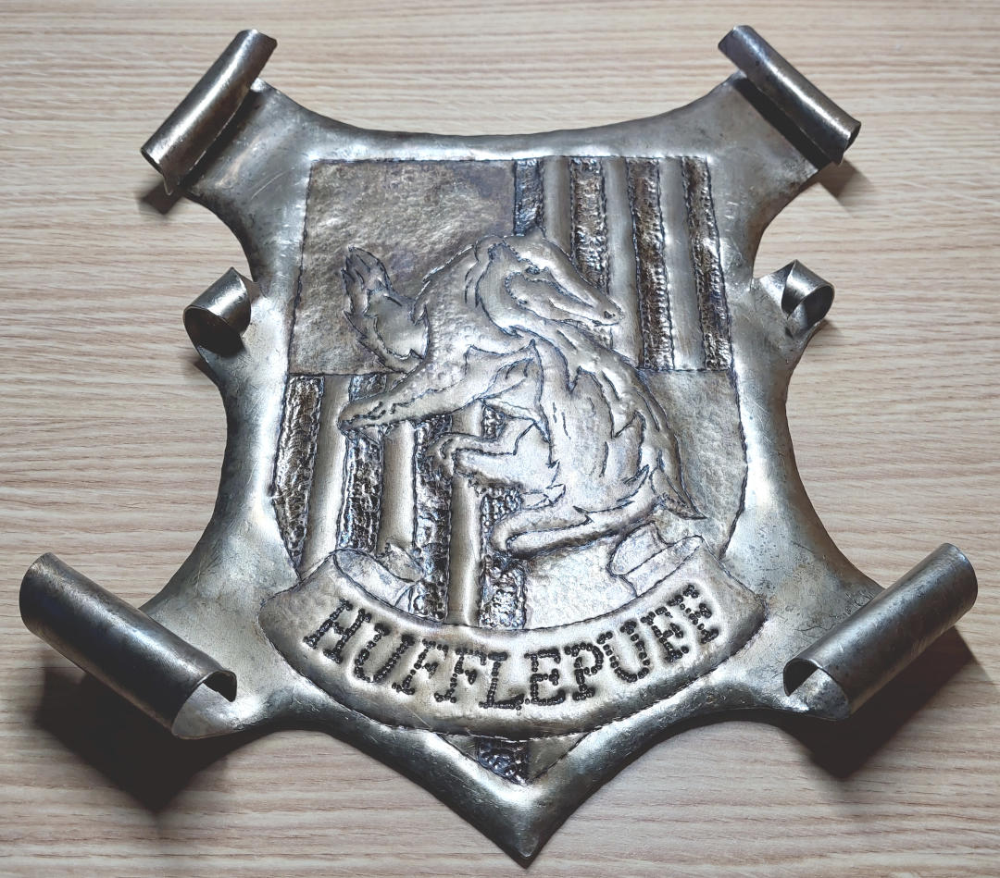
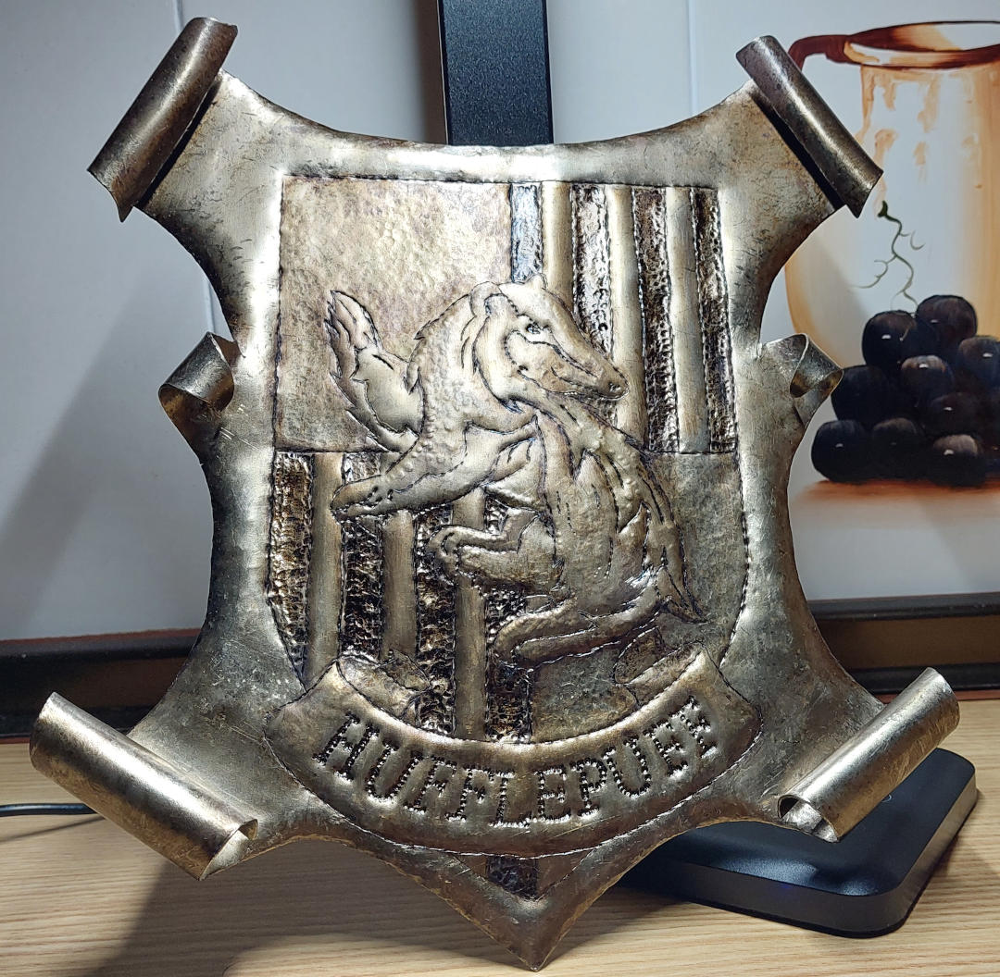
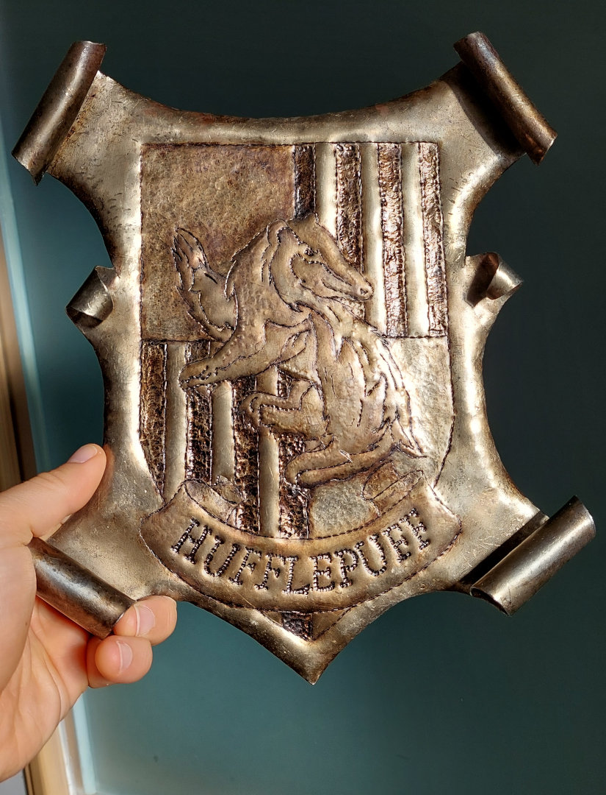

# Pátina - Acabado envejecido

```
AUTHOR: Samuel M.H.
DATE: 27-Julio-2024
LICENCE: all rights reserved.
```

## Introducción
Una de las opciones para conseguir un efecto de envejecido en nuestras piezas es darles una pátina. En mi caso, he usado betún de judea, un tinte oleoso marrón oscuro que venden en las tiendas de manualidades (~2,5€). Crea el efecto que estaba buscando, y además al secar, proporciona una capa de protección que evita que se oxide la pieza.


## Proceso

Herramientas y materiales:
* Betún de judea
* Pincel
* Aguarrás
* Periódicos para cubrir la superficie
* Papel de cocina o trapo


Proceso:
* Protege la superficie de trabajo.
* Es mejor empezar por las partes que sean más oscuras (líneas, sombras, etc).
* Aplica pequeñas pinceladas sobre la superficie, cubriendo bien las hendiduras.
* Pasa el trapo/papel de cocina por ecima de la superficie pintada.
  * La idea es retirar el betún de los brillos de la pieza (partes elevadas) y que se quede en las sombras (bajorrelieves). Con esto se consigue contraste.
  * Según el tiempo esperado, el resultado será más oscuro. Es mejor dar varias manos que esperar mucho, a riesgo de malograr la pieza (si esto pasa, se puede limpiar con aguarrás y volver a empezar).
* Evalua el resultado de la pieza. En mi caso acabé cubriendo toda la pieza de alguna manera.
* Si hay zonas en las que quieres brillos o retirar complétamente la pátina:
  * Moja (1 gota) un poco de papel en aguarrás a modo de pincel. **Que no gotee** (en serio, tiene que estar casi seco).
  * **Toca** las partes de la pieza donde quieres retirar la pátina. 
  * Pásale un papel por encima.
  * Esta técnica la hice para limitar bien el escudo por fuera y marcar las barras verticales de los cuadrantes.
* Cuando retires el betún con el papel/trapo, hazlo siempre en la misma dirección y sin apretar mucho al principio. Si no, tendrás borrones.
* Limpia bien el pincel con aguarrás.


## Ejemplo
Pieza original, escudo de chapa de acero con revenido dorado. Es muy brillante, se ve nuevo y carece de personalidad.




Resultado final, escudo envejecido. La pieza resalta y gana contraste aunque el brillo es menos vivo.





Con luz natural y sin retoques.



Los detalles del repujado se notan mucho mejor y la pieza gana expresividad según le incida la luz.


## Notas
* Como alternativas al betún de judea se podrían usar: tinta china (el acabado varía bastante), otro tipo de betunes o cualquier cosa (oleosa) que se pueda retirar y luego seque creando una capa oscura.
* Protege la superficie de trabajo. Sin quererlo volqué medio bote de betún en la mesa... y menos mal que la cubrí con periódicos, si no, ahora tendría... una mesa de judea.
* Ventila el lugar de trabajo, te puedes intoxicar con los disolventes al respirarlos.
* Aguarrás es lo mismo que esencia de trementina. Supongo que se podrá sustituir por acetona (quitaesmalte) o cualquier disolvente apolar.
