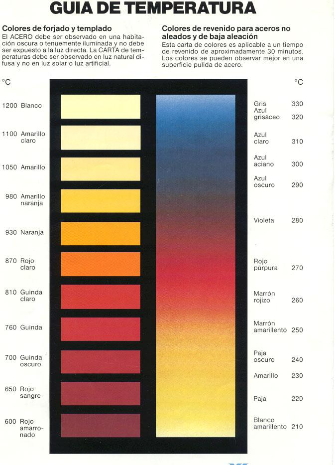

# Colores en el revenido del acero

```
AUTHOR: Samuel M.H.
DATE: 27-Julio-2024
LICENCE: all rights reserved.
```

## Introducción
El [revenido](https://es.wikipedia.org/wiki/Revenido) es un proceso en el que, una vez finalizada la pieza de acero, se recalienta para mejorar sus cualidades.

En este caso, la finalidad es decorativa. No se intenta mejorar las propiedades mécanicas de la pieza, sino conseguir un acabado en el color deseado.
El efecto se logra calentando la pieza a una temperatura y tiempos determinados con el fin de conseguir una oxidación uniforme en el tono elegido.

## Temperaturas y tiempos
Las siguientes cartas muestran una estimación de los parámetros temperatura y tiempo para conseguir el color objetivo.




Tonos que se logran con diferentes temperaturas.

**NOTA:** Los tonos están resaltados artificialmente para que se aprecien mejor.


## Ejemplo
Como ejemplo, expongo una pieza propia. Es un escudo repujado hecho en chapa de acero. El color original es gris metalizado (plateado).


La intención era dejarlo en tono amarillo metalizado (dorado). Se recalentó en un horno a 220-230ºC aprox durante 15 minutos.


El resultado fue un dorado brillante, como de moneda nueva.


## Notas
* Para conseguir el tono deseado es muy importante controlar los parámetros de **tiempo y temperatura**.
  * Tener el horno a la temperatura correcta antes de meter la pieza.
* **Es mejor quedarse corto** que pasarse. Siempre se puede calentar un poco más, pero si te pasas... ya no se puede volver atrás fácilmente (al final puedes decapar la pieza y empezar, pero es costoso). 
* Al sacar la pieza del horno, está caliente, con lo que continúa el **proceso de oxidación**. Es mejor sacarla un poco antes y dejarla reposar para evaluar el resultado y si se quiere continuar el proceso.
* La pieza debe estar **limpia**, si no, la oxidación no será uniforme. Puede ser útil para conseguir efectos.
* Dependiendo del **tipo de acero** pueden variar los resultados.
* La masa del objeto importa a la hora de calentarse (más pesado, más tarda en calentarse y en enfriarse). Esto ha de tenerse en cuenta. Por ejemplo: la chapa del ejemplo pesa poco, con lo que se calienta antes. Por eso reduje los parámetros de tiempo y temperatura. Además el color con el que salió del horno varió poco mientras se enfrió.

